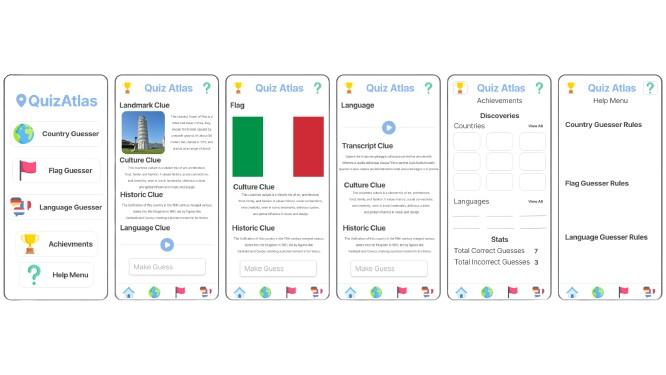

## Quiz Atlas

Quiz Atlas is a trivia game that offers users three exciting game modes. Test your knowledge by guessing countries, flags, or languages based on unique clues provided. Each game mode presents players with one distinctive clue along with additional hints for assistance. For instance, in the country guessing mode, users are presented with landmark images, while in the flag mode, they encounter flag images. Moreover, in the language mode, an audio sample challenges players. Keep track of your progress through the Achievements menu, where you can visualize all the countries, flags, and languages encountered during the game, along with stats on correct and incorrect guesses.

### Contributors:
- Bobby James
- Alex Turner
- Juan Arellano
- Ashley Salas Balladares

### Running the Application:

**Requirements**
- Android Studio (latest version recommended)
- Android device running Android 8 or higher (preferably the latest version)

**Instructions:**
1. Clone the repository to your local machine.
2. Open the project in Android Studio.
3. Connect your Android device or use an emulator.
4. Build and run the application on your device.

## Known Issues:
There are currently no known issues related to running or the code of the application.

### Overview of the Code:

Quiz Atlas utilizes a clean and efficient code structure. Here's a brief overview:

- **Launcher Activity**: This activity loads all the necessary data for the app using the Data Loader model and the Player model. Data is loaded from the CSV into the Country model and then into the list of countries for efficiency.

- **Onboarding Screens**: If it's the user's first time opening the app, they are greeted with three onboarding screens that introduce the app's features.

- **Main Activity**: This activity serves as the hub for navigating to all other activities within the app.

- **Game Modes**: Each game mode involves choosing a country from the list of countries. If the user hasn't discovered that country yet, it is saved for display in the Achievements menu. Unique clues along with additional hints are provided, and validation ensures accurate guessing. Upon completion, player data is saved.

- **Language Game**: Specific methods handle audio playback for the language game mode.

- **Achievements Menu**: Here, users can view a grid layout displaying the flags and languages encountered in the game, along with guess statistics. Data is persistent across relaunches using SharedPreferences.

- **Help Menu**: Displays game information and screen help for user assistance.

Feel free to explore the code and contribute to enhancing Quiz Atlas!